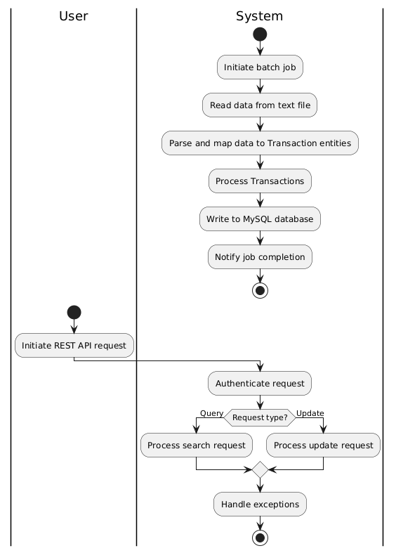

# Transaction App

## Overview

This Spring Boot application processes transaction data from a text file and stores it in a MySQL database. It provides RESTful APIs to search for transactions based on specific criteria (customer ID, account number, description) with pagination support. The application also allows updating the transaction description while handling concurrent updates. The entire API is secured using basic authentication.

## Activity Diagram
Below is the activity diagram for the application:



## Class Diagram
Below is the class diagram for the application:


## Prerequisites

- Docker
- Java 17 or later

## Setup Instructions

### 1. Clone the Repository
```bash
git clone https://github.com/jahid-csedu/transaction-app.git
cd transaction-app
```

### 2. Run the Database
Run the Database docker container
```bash
docker-compose up
```

### 2. Run the Application
You can run the application using Maven:
```bash
./mvnw spring-boot:run
```
Or build the project and run the JAR file:
```bash
./mvnw clean package
java -jar target/transaction-app-0.0.1-SNAPSHOT.jar
```
### 4. Accessing the Application
The application runs on port 8080 by default. All API endpoints are secured with basic authentication.

Authentication Details:

- Username: admin
- Password: admin
### 5. API Endpoints
####  GET /api/transactions
Search for transactions with optional pagination and filtering by customer ID, account number, or description.
```bash
curl -u admin:admin "http://localhost:8080/api/transactions?customerId=222&page=0&size=10"
```

####  PUT /api/transactions/{transactionId}
Update the description of a transaction with support for concurrent updates.
##### Example Request:
```bash
curl -X PUT -u admin:admin -H "Content-Type: application/json" -d '{"description": "updated description"}' "http://localhost:8080/api/transactions/1"
```

## Conclusion
This application provides a secure and efficient way to process and manage transaction data. By following the instructions above, you should be able to run the application locally and interact with the API endpoints securely.